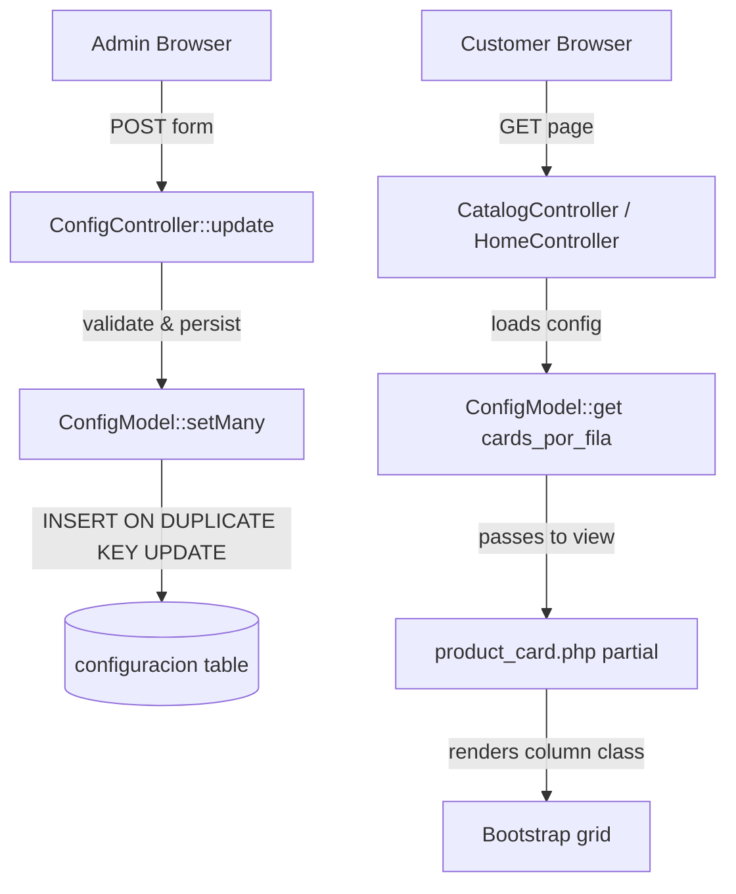

# Design Document: admin-config-tabs-cards

## Overview

This feature restructures the VILUNA admin configuration page (`admin/configuracion`) from a single long form into a Bootstrap 5 nav-tabs layout with four tabs: **General**, **Banner Hero**, **Apariencia**, and **Datos bancarios**. It also introduces a `cards_por_fila` configuration setting that controls how many product cards display per row on desktop, dynamically adjusting Bootstrap column classes in the product card partial.

The design philosophy is minimal-footprint: all changes stay within the existing MVC structure, use Bootstrap 5's built-in tab component (no extra JS libraries), and require zero new routes, controllers, or models.

## Architecture

The feature modifies three layers of the existing application:



**Key architectural decisions:**

1. **Single form wrapping all tabs** — All four tab panels live inside one `<form>`. This ensures a single POST saves everything regardless of which tab is active, matching the existing `ConfigController::update()` flow.

2. **No JavaScript framework** — Tab switching uses Bootstrap 5's native `data-bs-toggle="tab"` attributes (already available in the admin layout's Bootstrap bundle). No custom JS needed for tab navigation.

3. **Column class mapping via helper function** — A new global helper `cardColumnClass()` encapsulates the mapping from `cards_por_fila` values to Bootstrap column classes, keeping the partial simple and testable.

4. **Validation at controller level** — The `cards_por_fila` value is validated in `ConfigController::update()` before persistence, with invalid values silently ignored (not saved).

## Components and Interfaces

### 1. ConfigController (modified)

**File:** `app/controllers/Admin/ConfigController.php`

Changes:
- Add `'cards_por_fila'` to the `$allowed` array
- Add validation logic: only persist `cards_por_fila` if value is in `[2, 3, 4, 6]`

```php
// In update() method, after building $data from $allowed:
$validCardsPerRow = ['2', '3', '4', '6'];
if (isset($data['cards_por_fila']) && !in_array($data['cards_por_fila'], $validCardsPerRow, true)) {
    unset($data['cards_por_fila']); // discard invalid value
}
```

### 2. Configuration View — Tab Structure (rewritten)

**File:** `app/views/admin/configuracion/index.php`

The view is restructured as:

```html
<form method="POST" enctype="multipart/form-data" action="...">
  <input type="hidden" name="_csrf_token" ...>
  
  <!-- Nav tabs -->
  <ul class="nav nav-tabs" id="configTabs" role="tablist">
    <li class="nav-item"><a class="nav-link active" data-bs-toggle="tab" href="#tab-general">General</a></li>
    <li class="nav-item"><a class="nav-link" data-bs-toggle="tab" href="#tab-hero">Banner Hero</a></li>
    <li class="nav-item"><a class="nav-link" data-bs-toggle="tab" href="#tab-apariencia">Apariencia</a></li>
    <li class="nav-item"><a class="nav-link" data-bs-toggle="tab" href="#tab-bancarios">Datos bancarios</a></li>
  </ul>
  
  <!-- Tab content -->
  <div class="tab-content">
    <div class="tab-pane fade show active" id="tab-general">...</div>
    <div class="tab-pane fade" id="tab-hero">...</div>
    <div class="tab-pane fade" id="tab-apariencia">...</div>
    <div class="tab-pane fade" id="tab-bancarios">...</div>
  </div>
  
  <!-- Persistent action bar (always visible) -->
  <div class="config-action-bar">
    <button type="submit" class="btn btn-gold">Guardar configuración</button>
    <a href="..." class="btn btn-outline-gold">Configurar secciones del Home</a>
    <button type="submit" name="reset_theme" value="1" ...>Restablecer estilo y logo</button>
  </div>
</form>
```

**Tab content distribution:**

| Tab | Fields |
|-----|--------|
| General | nombre_tienda, correo_contacto, whatsapp, whatsapp_mensaje, direccion, slogan, metadescripcion, facebook, instagram |
| Banner Hero | hero_activo, hero_tagline, hero_titulo, hero_descripcion, hero_fondo_color, hero_imagen |
| Apariencia | logo_principal, cards_por_fila (select), all 17 theme_* color pickers |
| Datos bancarios | banco_nombre, banco_cuenta, banco_tipo, banco_beneficiario |

### 3. cards_por_fila Select Control

Located in the "Apariencia" tab:

```html
<label class="form-label">Productos por fila (escritorio)</label>
<select name="cards_por_fila" class="form-select" style="max-width:200px;">
  <option value="2" <?= ($config['cards_por_fila'] ?? '4') === '2' ? 'selected' : '' ?>>2 por fila</option>
  <option value="3" <?= ($config['cards_por_fila'] ?? '4') === '3' ? 'selected' : '' ?>>3 por fila</option>
  <option value="4" <?= ($config['cards_por_fila'] ?? '4') === '4' ? 'selected' : '' ?>>4 por fila</option>
  <option value="6" <?= ($config['cards_por_fila'] ?? '4') === '6' ? 'selected' : '' ?>>6 por fila</option>
</select>
```

### 4. Helper Function — cardColumnClass()

**File:** `core/helpers.php`

```php
if (!function_exists('cardColumnClass')) {
    /**
     * Returns Bootstrap column classes for product cards based on cards_por_fila config value.
     */
    function cardColumnClass(string|int $cardsPerRow = 4): string
    {
        return match ((string)$cardsPerRow) {
            '2' => 'col-6',
            '3' => 'col-6 col-md-4',
            '4' => 'col-6 col-md-4 col-xl-3',
            '6' => 'col-6 col-md-4 col-lg-2',
            default => 'col-6 col-md-4 col-xl-3',
        };
    }
}
```

### 5. Product Card Partial (modified)

**File:** `app/views/partials/product_card.php`

Replace the hardcoded column class:

```php
<?php
// Before (hardcoded):
// <div class="col-6 col-md-4 col-xl-3">

// After (dynamic):
$colClass = cardColumnClass(\App\Models\ConfigModel::get('cards_por_fila', '4'));
?>
<div class="<?= $colClass ?>">
```

### 6. Admin CSS Addition

**File:** `public/assets/css/admin.css`

```css
/* Config action bar — always visible below tabs */
.config-action-bar {
  display: flex;
  gap: 0.5rem;
  flex-wrap: wrap;
  padding: 1.25rem 0 0;
  margin-top: 1.5rem;
  border-top: 1px solid #dee2e6;
}
```

## Data Models

### Configuration Table (existing — no migration needed)

| Key | Type | Constraints | Default |
|-----|------|-------------|---------|
| `cards_por_fila` | string (stored as VARCHAR) | One of: '2', '3', '4', '6' | '4' |

No schema change is needed. The `configuracion` table already stores arbitrary key-value pairs. The new `cards_por_fila` key is simply inserted via `ConfigModel::set()`.

### Validation Rules

| Field | Rule | Action on failure |
|-------|------|-------------------|
| `cards_por_fila` | Must be in `['2','3','4','6']` | Silently discard; keep previous value |
| `logo_principal` | JPEG/PNG, ≤ 2 MB | Flash error, keep old file |
| `hero_imagen` | JPEG/PNG, ≤ 2 MB | Flash error, keep old file |
| All text fields | Trimmed, stored as-is | No special validation (optional) |
| `theme_*` colors | 7-char hex `#RRGGBB` (validated by browser input[type=color]) | Browser enforces format |


## Correctness Properties

*A property is a characteristic or behavior that should hold true across all valid executions of a system—essentially, a formal statement about what the system should do. Properties serve as the bridge between human-readable specifications and machine-verifiable correctness guarantees.*

### Property 1: cards_por_fila validation — only valid values are persisted

*For any* string value submitted as `cards_por_fila`, the value SHALL be persisted to the database if and only if it is exactly one of '2', '3', '4', or '6'. All other values (arbitrary strings, numbers outside the set, empty string, null-like values) SHALL be silently discarded without modifying the previously stored value.

**Validates: Requirements 6.1, 6.2, 6.3**

### Property 2: cardColumnClass fallback — invalid inputs always produce default classes

*For any* input value that is not one of '2', '3', '4', or '6' (including empty strings, null, negative numbers, floats, arbitrary strings, very large numbers), the `cardColumnClass()` function SHALL return `'col-6 col-md-4 col-xl-3'` (the default for 4 cards per row).

**Validates: Requirements 7.1, 7.6**

## Error Handling

| Scenario | Handling | User Feedback |
|----------|----------|---------------|
| Invalid `cards_por_fila` value submitted | Value silently discarded; other fields saved normally | No error shown (graceful degradation) |
| Logo upload exceeds 2 MB or wrong format | `FileUploader` throws `\InvalidArgumentException`; caught in `handleLogoUpload()` | Flash error: "Logo no actualizado: {reason}" |
| Hero image upload exceeds 2 MB or wrong format | `FileUploader` throws `\InvalidArgumentException`; caught in `handleHeroImageUpload()` | Flash error: "Imagen hero no actualizada: {reason}" |
| CSRF token mismatch | Handled by base Controller middleware (existing behavior) | 403 redirect |
| Database write failure in `ConfigModel::set()` | PDO exception propagates to global error handler | 500 error page |
| Missing `cards_por_fila` key in database | `ConfigModel::get('cards_por_fila', '4')` returns default '4' | No error; form shows "4 por fila" selected |
| Invalid hex color in theme_* field | Browser `input[type=color]` enforces valid format; `normalizeHexColor()` provides fallback | Default color used silently |

## Testing Strategy

### Unit Tests (example-based)

Unit tests cover specific scenarios and edge cases using PHPUnit:

1. **cardColumnClass() mapping** — Verify each valid input returns the correct class string:
   - `'2'` → `'col-6'`
   - `'3'` → `'col-6 col-md-4'`
   - `'4'` → `'col-6 col-md-4 col-xl-3'`
   - `'6'` → `'col-6 col-md-4 col-lg-2'`

2. **cards_por_fila validation** — Verify the controller validation logic accepts only `['2','3','4','6']` and rejects values like `'5'`, `'0'`, `'7'`, `'-1'`, `'abc'`, `''`.

3. **Default value behavior** — When no `cards_por_fila` is stored, `ConfigModel::get('cards_por_fila', '4')` returns `'4'`.

4. **hero_activo checkbox** — Verify unchecked results in `'0'` being stored.

### Property-Based Tests

Property-based tests use a PBT library (e.g., [Eris](https://github.com/giorgiosironi/eris) for PHP or a custom generator approach with PHPUnit's data providers generating randomized inputs) to verify universal properties across many inputs.

**Configuration:**
- Minimum 100 iterations per property test
- Each test references its design document property via tag comment

**Property tests to implement:**

1. **Feature: admin-config-tabs-cards, Property 1: cards_por_fila validation**
   - Generate random strings (alphanumeric, empty, numeric including negatives, floats, special characters)
   - Assert: value is persisted ↔ value ∈ {'2','3','4','6'}

2. **Feature: admin-config-tabs-cards, Property 2: cardColumnClass fallback**
   - Generate random inputs (strings, integers, null, empty, special chars)
   - Assert: if input ∉ {'2','3','4','6'} then output === 'col-6 col-md-4 col-xl-3'

### Integration Tests

Integration tests verify end-to-end behavior through the HTTP layer:

1. **Full form submission** — POST all fields from all tabs, verify all persisted in DB.
2. **Reset theme** — POST with `reset_theme=1`, verify 17 colors reset to defaults and files deleted.
3. **Invalid file upload** — Upload oversized file, verify error flash and no file change.
4. **Tab rendering** — GET config page, verify HTML contains four tabs with correct IDs and content.

### Test File Location

```
tests/
├── Unit/
│   ├── CardColumnClassTest.php
│   └── ConfigValidationTest.php
└── Integration/
    └── ConfigControllerTest.php
```
