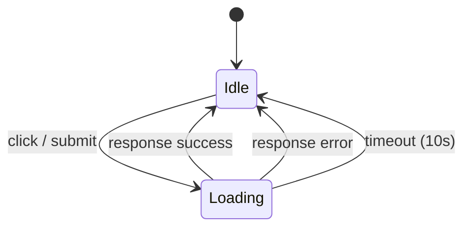

# Design Document: Button Loading States

## Overview

Implementar un sistema de estados de carga (loading) para todos los botones de acción del Sistema Viluna. El sistema consiste en un módulo JavaScript reutilizable que intercepta envíos de formularios y clics en botones AJAX, mostrando un spinner y deshabilitando el botón para prevenir envíos duplicados.

## Architecture

El sistema se implementa como un módulo JavaScript global (`loading.js`) que se carga en ambos layouts (público y admin). Utiliza delegación de eventos y un atributo data (`data-loading-text`) para configurar el texto de carga por botón.

Flujo:
1. Usuario hace clic en un botón de acción
2. El handler intercepta el evento, guarda el estado original del botón
3. Aplica el estado de carga (disabled + spinner + texto)
4. Registra un timeout de seguridad (10s)
5. Al completar la solicitud (éxito o error), restaura el botón
6. Si no se restaura manualmente, el timeout lo restaura automáticamente



## Components and Interfaces

### `public/assets/js/loading.js` — Módulo principal

Funciones expuestas:

```javascript
/**
 * Aplica estado de carga a un botón.
 * @param {HTMLButtonElement} btn - El botón objetivo
 * @param {string} [loadingText] - Texto a mostrar durante carga (default: "Procesando...")
 * @returns {Function} restore - Función para restaurar el botón a su estado original
 */
function startLoading(btn, loadingText)

/**
 * Restaura un botón a su estado original.
 * @param {HTMLButtonElement} btn - El botón a restaurar
 */
function stopLoading(btn)
```

### Integración con formularios (submit events)

Para formularios con envío tradicional (POST con page reload), se intercepta el evento `submit` del form y se aplica loading al botón submit. No se necesita restauración manual porque la página se recarga.

### Integración con AJAX

Para botones que disparan solicitudes AJAX (cupón, carrito), se modifica el código existente en `cart.js` y `app.js` para llamar `startLoading` antes de la solicitud y `stopLoading` en el `finally`.

### Atributo `data-loading-text`

Los botones pueden definir un texto personalizado de carga:
```html
<button type="submit" data-loading-text="Confirmando...">Confirmar pedido</button>
```

Si no se define, se usa "Procesando..." por defecto.

## Data Models

No se requieren cambios en modelos de datos. Este feature es puramente frontend.

Estado interno por botón (almacenado en un WeakMap):
```javascript
{
  originalHTML: string,    // innerHTML original del botón
  originalDisabled: bool,  // estado disabled original
  timeoutId: number|null   // ID del setTimeout de seguridad
}
```

## Correctness Properties

*A property is a characteristic or behavior that should hold true across all valid executions of a system-essentially, a formal statement about what the system should do. Properties serve as the bridge between human-readable specifications and machine-verifiable correctness guarantees.*

### Property 1: Loading state transition

*For any* HTML button element with any inner HTML content, calling `startLoading` on that button SHALL result in the button having `disabled === true` and its innerHTML containing a spinner element (`.spinner-border`).

**Validates: Requirements 1.1, 2.1, 2.2, 2.3**

### Property 2: Round-trip restoration

*For any* HTML button element with any initial content and disabled state, calling `startLoading` followed by `stopLoading` SHALL restore the button's innerHTML and disabled state to their exact original values.

**Validates: Requirements 1.3, 4.1**

### Property 3: Timeout safety net

*For any* HTML button element in loading state, if `stopLoading` is not called explicitly, the button SHALL be automatically restored to its original state within 10 seconds.

**Validates: Requirements 4.3**

## Error Handling

- Si el formulario se envía y la página se recarga (server-side validation error), el botón se renderiza en estado normal por defecto HTML — no se necesita lógica especial.
- Para solicitudes AJAX, el bloque `finally` siempre llama `stopLoading`, cubriendo tanto éxito como error de red.
- El timeout de 10 segundos actúa como red de seguridad para casos imprevistos donde `stopLoading` no se invoque.

## Testing Strategy

### Enfoque dual de testing

Se usarán ambos enfoques complementarios:

**Unit tests**: Verifican ejemplos específicos de integración (que los botones correctos tengan los atributos, que el módulo se carga en ambos layouts).

**Property-based tests**: Verifican las propiedades universales del módulo de loading usando [fast-check](https://github.com/dubzzz/fast-check) como librería PBT.

### Configuración

- Framework: PHPUnit no aplica aquí (es puramente JS). Se usará **Vitest** como test runner con **jsdom** para simular DOM.
- PBT library: **fast-check** (integrado con Vitest).
- Cada property-based test ejecutará un mínimo de 100 iteraciones.
- Cada property-based test incluirá un comentario con formato: `**Feature: button-loading-states, Property {number}: {property_text}**`

### Tests a implementar

1. Property test: Loading state transition (Property 1)
2. Property test: Round-trip restoration (Property 2)  
3. Property test: Timeout safety net (Property 3)
4. Unit tests: Verificar integración en vistas específicas (checkout, carrito, admin)
