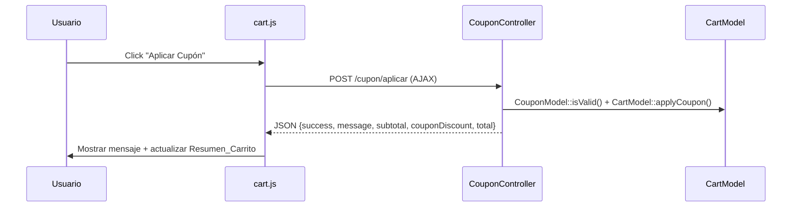
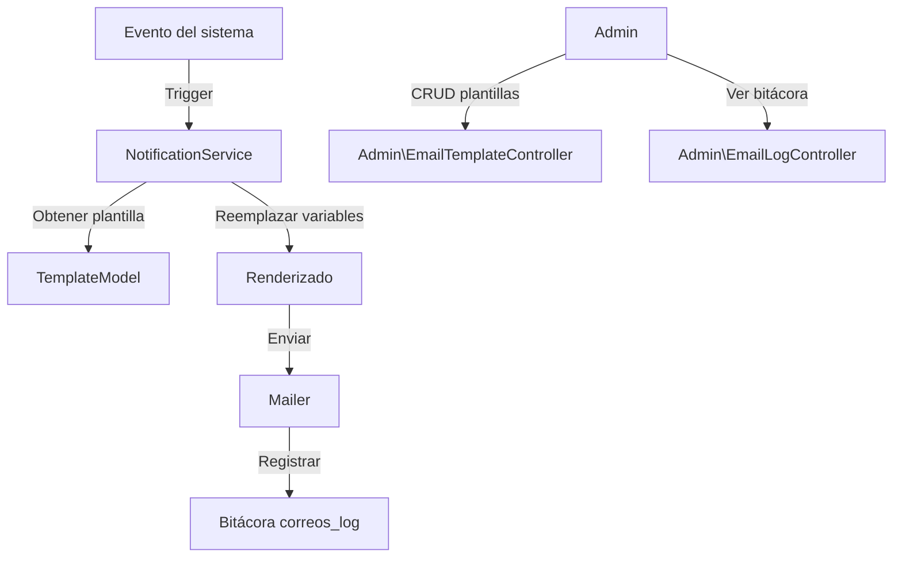

# Design Document: Coupons Fix & Email Notifications

## Overview

Este diseño abarca dos mejoras:
1. **Corrección de cupones**: El sistema AJAX de aplicación de cupones actualmente muestra "Error al aplicar el cupón" aunque el cupón se aplica correctamente en backend. El problema es doble: (a) las URLs AJAX en `cart.js` están hardcoded sin base path, y (b) la respuesta JSON del controller no incluye `subtotal`. Además, la UI debe actualizarse inmediatamente sin reload.
2. **Sistema de notificaciones por correo**: Extender el `Mailer` existente para enviar correos en todos los eventos importantes, con plantillas administrables en base de datos y bitácora de envíos.

## Architecture

### Corrección de Cupones

El flujo actual ya es correcto en backend (`CouponController::apply()` funciona bien). El problema está en el frontend:



Cambios necesarios:
- `CouponController::apply()` — agregar `subtotal` en la respuesta JSON
- `cart.js` — usar `APP_URL` base para URLs AJAX, mejorar manejo de errores, actualizar UI sin reload

### Sistema de Notificaciones



## Components and Interfaces

### Corrección de Cupones

#### `app/controllers/CouponController.php` (modificación)

Agregar `subtotal` a la respuesta AJAX:
```php
$this->json([
    'success'        => true,
    'message'        => $result['message'],
    'porcentaje'     => $result['coupon']['porcentaje'],
    'codigo'         => $result['coupon']['codigo'],
    'subtotal'       => CartModel::getSubtotal(),
    'couponDiscount' => CartModel::getCouponDiscount(),
    'total'          => CartModel::calculateTotal(),
    'totalItems'     => CartModel::getTotalItems(),
]);
```

#### `public/assets/js/cart.js` (modificación)

- Obtener base URL de un meta tag o de `<base>` en el HTML
- Usar URLs relativas al base path
- Actualizar el resumen del carrito sin hacer `location.reload()`
- Mostrar/ocultar la fila de descuento dinámicamente
- Distinguir entre errores de validación (422) y errores de red (catch)

### Sistema de Notificaciones por Correo

#### `app/models/EmailTemplateModel.php` (nuevo)

```php
class EmailTemplateModel extends Model
{
    public static function findBySlug(string $slug): ?array;
    public static function findAll(): array;
    public static function update(int $id, array $data): void;
    public static function render(string $slug, array $variables): array;
    // Returns: ['subject' => string, 'body' => string]
}
```

#### `app/models/EmailLogModel.php` (nuevo)

```php
class EmailLogModel extends Model
{
    public static function create(array $data): int;
    public static function findAll(int $limit, int $offset): array;
    public static function countAll(): int;
}
```

#### `services/Mailer.php` (modificación)

Extender `send()` para registrar en la bitácora:
```php
public function send(...): bool
{
    // ... enviar correo ...
    EmailLogModel::create([
        'destinatario' => $to,
        'asunto'       => $subject,
        'estado'       => $success ? 'enviado' : 'error',
        'error_msg'    => $errorMsg ?? null,
    ]);
    return $success;
}
```

#### `services/NotificationService.php` (nuevo)

Servicio centralizado para disparar notificaciones:
```php
class NotificationService
{
    public static function welcomeEmail(array $user): void;
    public static function orderConfirmation(int $orderId): void;
    public static function paymentConfirmed(int $orderId): void;
    public static function orderStatusChanged(int $orderId, string $newStatus, ?string $comments): void;
    public static function adminNewUser(array $user): void;
    public static function adminNewOrder(int $orderId): void;
    public static function adminPaymentReceived(int $orderId): void;
    public static function adminNewReview(int $reviewId): void;
}
```

#### `app/controllers/Admin/EmailTemplateController.php` (nuevo)

- `index()` — Lista de plantillas
- `edit()` — Formulario de edición
- `update()` — Guardar cambios

#### `app/controllers/Admin/EmailLogController.php` (nuevo)

- `index()` — Bitácora con paginación

## Data Models

### Tabla `plantillas_correo`

```sql
CREATE TABLE plantillas_correo (
    id          INT UNSIGNED AUTO_INCREMENT PRIMARY KEY,
    slug        VARCHAR(50) NOT NULL UNIQUE,
    nombre      VARCHAR(100) NOT NULL,
    asunto      VARCHAR(255) NOT NULL,
    contenido   TEXT NOT NULL,
    variables   TEXT NOT NULL COMMENT 'JSON array of available variable names',
    updated_at  DATETIME NOT NULL DEFAULT CURRENT_TIMESTAMP ON UPDATE CURRENT_TIMESTAMP
);
```

Plantillas seed:
- `welcome` — Bienvenida al registrarse
- `password_reset` — Recuperación de contraseña
- `order_confirmation` — Confirmación de pedido
- `payment_confirmed` — Pago confirmado
- `order_status` — Cambio de estado
- `admin_new_user` — Notificación admin: nuevo usuario
- `admin_new_order` — Notificación admin: nuevo pedido
- `admin_payment_received` — Notificación admin: comprobante recibido
- `admin_new_review` — Notificación admin: nueva reseña

### Tabla `correos_log`

```sql
CREATE TABLE correos_log (
    id            INT UNSIGNED AUTO_INCREMENT PRIMARY KEY,
    destinatario  VARCHAR(255) NOT NULL,
    asunto        VARCHAR(255) NOT NULL,
    fecha_envio   DATETIME NOT NULL DEFAULT CURRENT_TIMESTAMP,
    estado        ENUM('enviado','error') NOT NULL DEFAULT 'enviado',
    error_mensaje TEXT DEFAULT NULL,
    INDEX idx_correos_fecha (fecha_envio DESC),
    INDEX idx_correos_estado (estado)
);
```

## Correctness Properties

*A property is a characteristic or behavior that should hold true across all valid executions of a system—essentially, a formal statement about what the system should do. Properties serve as the bridge between human-readable specifications and machine-verifiable correctness guarantees.*

### Property 1: Coupon AJAX response contains complete summary data

*For any* valid coupon applied to a non-empty cart, the JSON response SHALL contain `success: true`, a non-empty `message`, and numeric values for `subtotal`, `couponDiscount`, and `total` where `total = subtotal - couponDiscount`.

**Validates: Requirements 1.1, 1.2, 1.5**

### Property 2: Invalid coupons produce specific rejection messages

*For any* coupon code that is non-existent, inactive, expired, or exhausted, the validation function SHALL return `valid: false` with a distinct, non-empty error message specific to the rejection reason.

**Validates: Requirements 1.3**

### Property 3: Coupon discount calculation consistency

*For any* cart with items and a valid coupon with percentage P, the `couponDiscount` SHALL equal `subtotal * (P / 100)` rounded to 2 decimal places, and `total` SHALL equal `subtotal - couponDiscount` and never be negative.

**Validates: Requirements 1.2**

### Property 4: Template variable replacement completeness

*For any* email template containing Variable_Dinamica markers and a complete set of replacement values, the rendered output SHALL contain zero unresolved variable markers (no `{variable_name}` patterns remaining).

**Validates: Requirements 8.4**

### Property 5: Email log records match send outcomes

*For any* email send attempt, the Bitácora_Correos SHALL contain exactly one new record where: if send succeeded, `estado = 'enviado'` and `error_mensaje IS NULL`; if send failed, `estado = 'error'` and `error_mensaje` is non-empty.

**Validates: Requirements 9.2, 9.3**

### Property 6: Order confirmation email contains all required fields

*For any* order with products, the rendered order confirmation email SHALL contain the order number, at least one product name, a total amount, a payment method, and a shipping address.

**Validates: Requirements 4.1**

## Error Handling

### Cupones
- Si el cupón es inválido: mostrar mensaje específico del tipo de error (no existe, expirado, inactivo, límite alcanzado)
- Si la petición AJAX falla por red: mostrar "Error de conexión. Verifica tu internet e intenta de nuevo." (distinto del error de validación)
- Si el carrito está vacío al aplicar cupón: rechazar con mensaje apropiado

### Correos
- Si el envío falla: registrar en `correos_log` con estado "error" y mensaje de error
- Nunca interrumpir el flujo principal (registro, pedido, pago) por fallo de correo
- Si la plantilla no existe en DB: usar la plantilla PHP existente como fallback
- Si una variable no tiene valor: reemplazar con string vacío en lugar de dejar el marker

## Testing Strategy

### Enfoque dual de testing

**Unit tests**: Verifican que los controllers devuelven la estructura JSON correcta, que las plantillas renderizan correctamente, y que la bitácora se escribe.

**Property-based tests**: Verifican propiedades universales del cálculo de cupones, la completitud de reemplazo de variables, y la consistencia de la bitácora.

### Configuración

- Framework de tests: **PHPUnit 10.5** (ya instalado)
- PBT library: **Eris** (ya instalado — `giorgiosironi/eris`)
- Cada property-based test ejecutará un mínimo de 100 iteraciones
- Cada property-based test incluirá un comentario: `**Feature: coupons-and-email-notifications, Property {number}: {property_text}**`

### Tests a implementar

1. Property test: Coupon AJAX response completeness (Property 1)
2. Property test: Invalid coupon rejection messages (Property 2)
3. Property test: Coupon discount calculation (Property 3)
4. Property test: Template variable replacement (Property 4)
5. Property test: Email log consistency (Property 5)
6. Property test: Order confirmation content (Property 6)

</content>
</invoke>