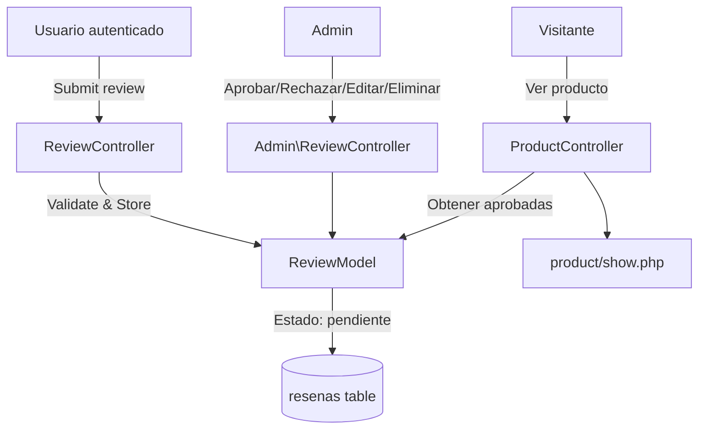

# Design Document: Product Reviews & Ratings

## Overview

Implementar un sistema de reseñas (comentario + calificación 1-5 estrellas) para productos en la tienda VILUNA. Las reseñas requieren autenticación y aprobación administrativa. Se integra con las secciones configurables del home para mostrar productos mejor valorados, con más comentarios, y testimonios destacados.

## Architecture

El sistema sigue la misma arquitectura MVC existente:

- **Model**: `ReviewModel` — CRUD, agregaciones, queries por filtro
- **Controllers**: `ProductController` (vista pública con reseñas), `ReviewController` (submit público), `Admin\ReviewController` (gestión admin)
- **Views**: Formulario de reseña en product/show, sección de reseñas aprobadas, panel admin de moderación
- **Integración Home**: Nuevos tipos de sección en `ProductModel::getBySection()`



## Components and Interfaces

### `app/models/ReviewModel.php`

```php
class ReviewModel extends Model
{
    // Crear reseña
    public static function create(array $data): int;

    // Obtener reseñas aprobadas de un producto
    public static function getApprovedByProduct(int $productId): array;

    // Calcular promedio y conteo de un producto
    public static function getProductStats(int $productId): array;
    // Returns: ['promedio' => float, 'total_valoraciones' => int, 'total_comentarios' => int]

    // Verificar si usuario ya tiene reseña en producto
    public static function userHasReview(int $userId, int $productId): bool;

    // Contar reseñas del usuario en últimas 24h
    public static function countRecentByUser(int $userId): int;

    // Admin: listar con filtros
    public static function findFiltered(array $filters, int $limit, int $offset): array;
    public static function countFiltered(array $filters): int;

    // Admin: cambiar estado
    public static function approve(int $id): void;
    public static function reject(int $id): void;
    public static function delete(int $id): void;
    public static function updateComment(int $id, string $text): void;

    // Para secciones del home
    public static function getTopRatedProductIds(int $limit): array;
    public static function getMostReviewedProductIds(int $limit): array;
    public static function getTestimonials(int $limit): array;
}
```

### `app/controllers/ReviewController.php` (público)

- `store()` — POST /producto/{slug}/resena — Valida, sanitiza, crea reseña

### `app/controllers/Admin/ReviewController.php`

- `index()` — GET /admin/resenas — Lista con filtros y paginación
- `approve()` — POST /admin/resenas/{id}/aprobar
- `reject()` — POST /admin/resenas/{id}/rechazar
- `edit()` — GET /admin/resenas/{id}/editar
- `update()` — POST /admin/resenas/{id}/editar
- `delete()` — POST /admin/resenas/{id}/eliminar

### Integración con ProductController

El `show()` existente pasará `$stats` y `$resenas` a la vista.

### Integración con Home Sections

Se agregan 3 tipos nuevos al `ConfigController::HOME_SECTION_TYPES`:
- `top_rated` → Productos mejor valorados
- `most_reviewed` → Productos con más comentarios
- `testimonials` → Testimonios destacados

## Data Models

### Tabla `resenas`

```sql
CREATE TABLE resenas (
    id             INT UNSIGNED AUTO_INCREMENT PRIMARY KEY,
    usuario_id     INT UNSIGNED NOT NULL,
    producto_id    INT UNSIGNED NOT NULL,
    calificacion   TINYINT UNSIGNED NOT NULL,
    comentario     TEXT NOT NULL,
    estado         ENUM('pendiente','aprobado','rechazado') NOT NULL DEFAULT 'pendiente',
    ip_address     VARCHAR(45) DEFAULT NULL,
    fecha_creacion DATETIME NOT NULL DEFAULT CURRENT_TIMESTAMP,
    UNIQUE KEY uq_usuario_producto (usuario_id, producto_id),
    CONSTRAINT fk_resenas_usuario FOREIGN KEY (usuario_id)
        REFERENCES usuarios(id) ON UPDATE CASCADE ON DELETE CASCADE,
    CONSTRAINT fk_resenas_producto FOREIGN KEY (producto_id)
        REFERENCES productos(id) ON UPDATE CASCADE ON DELETE CASCADE,
    CONSTRAINT chk_calificacion CHECK (calificacion >= 1 AND calificacion <= 5)
);

CREATE INDEX idx_resenas_producto_estado ON resenas (producto_id, estado);
CREATE INDEX idx_resenas_usuario ON resenas (usuario_id);
CREATE INDEX idx_resenas_fecha ON resenas (fecha_creacion DESC);
```

## Correctness Properties

*A property is a characteristic or behavior that should hold true across all valid executions of a system—essentially, a formal statement about what the system should do. Properties serve as the bridge between human-readable specifications and machine-verifiable correctness guarantees.*

### Property 1: Review creation defaults to pending state

*For any* valid review data (rating 1-5, comment 10-1000 chars, authenticated user, product exists, no prior review), creating a review SHALL result in a record with `estado = 'pendiente'`.

**Validates: Requirements 1.1**

### Property 2: Input validation rejects invalid reviews

*For any* rating value outside the range [1, 5] OR any comment text with length < 10 or > 1000, the validation function SHALL reject the input.

**Validates: Requirements 1.2, 1.3**

### Property 3: Data completeness on creation

*For any* valid review submission, the stored record SHALL contain the submitted user_id, producto_id, comentario, calificacion, a non-null ip_address, and a non-null fecha_creacion.

**Validates: Requirements 1.5**

### Property 4: Duplicate review rejection

*For any* user and product where a review already exists, attempting to create a second review SHALL be rejected regardless of the new review's content.

**Validates: Requirements 1.6**

### Property 5: State transitions preserve review data

*For any* review in "pendiente" state, approving or rejecting it SHALL only change the `estado` field while preserving usuario_id, producto_id, comentario, calificacion, ip_address, and fecha_creacion unchanged.

**Validates: Requirements 2.2, 2.3**

### Property 6: Edit preserves immutable fields

*For any* review and any new comment text, updating the comment SHALL preserve the original usuario_id, producto_id, calificacion, ip_address, and fecha_creacion.

**Validates: Requirements 2.5**

### Property 7: Aggregations use only approved reviews

*For any* set of reviews for a product with mixed states (pendiente, aprobado, rechazado), the calculated average rating and count SHALL consider only reviews with estado = 'aprobado'.

**Validates: Requirements 3.1, 3.3**

### Property 8: Sanitization removes HTML and script content

*For any* comment text containing HTML tags or script elements, the sanitization function SHALL return text without any HTML tags while preserving the non-HTML textual content.

**Validates: Requirements 6.1**

### Property 9: Testimonials filter by rating threshold

*For any* set of reviews, the testimonials query SHALL return only reviews with estado = 'aprobado' AND calificacion >= 4.

**Validates: Requirements 5.1**

## Error Handling

- Formulario de reseña muestra errores de validación inline (rating faltante, texto muy corto/largo)
- Si el usuario ya reseñó el producto, mostrar mensaje informativo en lugar del formulario
- Rate limit (3 reseñas/24h): mostrar mensaje con tiempo estimado de espera
- Si un producto no existe al intentar reseñar, retornar 404
- Las operaciones admin que fallan (registro no encontrado) redirigen con flash de error

## Testing Strategy

### Enfoque dual de testing

**Unit tests**: Verifican integración (rutas correctas, vistas con datos esperados, middleware de auth).

**Property-based tests**: Verifican las propiedades universales del modelo de reseñas usando **fast-check** integrado con **Vitest** y **jsdom** para la parte de sanitización.

Dado que el proyecto es PHP y no tiene test runner PHP configurado, los property tests se implementarán como tests de la lógica de validación y sanitización en JavaScript (donde se usa fast-check). Para la lógica PHP del modelo, se usarán tests manuales con PHPUnit si se configura, o se verificará mediante tests funcionales.

### Configuración

- Framework de tests: **Vitest** con **jsdom**
- PBT library: **fast-check**
- Cada property-based test ejecutará un mínimo de 100 iteraciones
- Cada property-based test incluirá un comentario: `**Feature: product-reviews, Property {number}: {property_text}**`

### Tests a implementar

1. Property test: Review creation defaults to pending (Property 1)
2. Property test: Input validation (Property 2)
3. Property test: Data completeness (Property 3)
4. Property test: Duplicate rejection (Property 4)
5. Property test: State transitions preserve data (Property 5)
6. Property test: Edit preserves immutable fields (Property 6)
7. Property test: Aggregations use only approved (Property 7)
8. Property test: Sanitization removes HTML (Property 8)
9. Property test: Testimonials filter (Property 9)
