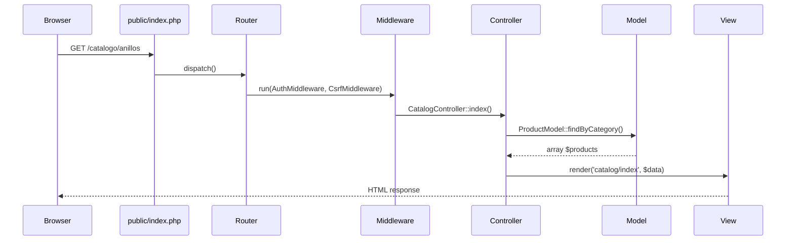
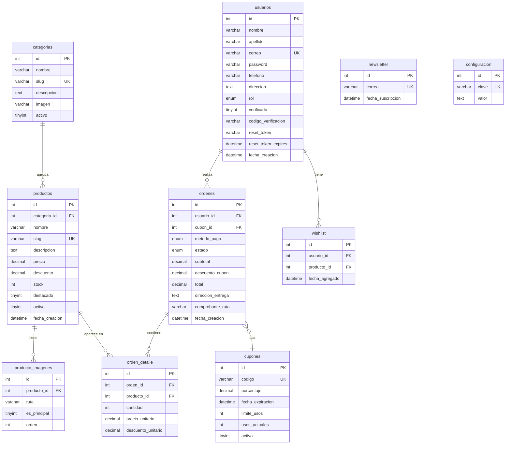

# Documento de Diseño Técnico — VILUNA Jewelry Store

## Visión General

VILUNA es una tienda virtual de joyería fina construida sobre PHP 8+ con arquitectura MVC personalizada (sin framework), MySQL 8+ como base de datos relacional, Bootstrap 5 para el frontend responsive y JavaScript/AJAX para interacciones dinámicas. El sistema debe operar tanto en Laragon (desarrollo local en Windows) como en hosting Linux compartido de GoDaddy (producción).

El diseño prioriza:
- **Seguridad** — CSRF, XSS, SQL Injection, validación MIME real de archivos.
- **Mantenibilidad** — separación clara de capas (MVC), autoload PSR-4 vía Composer.
- **Experiencia premium** — identidad visual Dorado/Negro/Blanco, UI responsive, galería con zoom.
- **Operatividad** — correos transaccionales con PHPMailer, Google OAuth, pagos contra entrega y transferencia bancaria.

---

## Arquitectura

### Patrón MVC Personalizado

El sistema implementa el patrón Modelo–Vista–Controlador sin dependencia de frameworks externos. El punto de entrada único es `public/index.php`.

```
Request
  └── public/index.php
        ├── bootstrap (config, session, autoload)
        └── Router
              ├── MiddlewareStack (CSRF, Auth, SecurityHeaders)
              └── Controller → Model → View
```

### Estructura de Directorios

```
viluna/
├── app/
│   ├── controllers/          # Controladores de dominio
│   ├── models/               # Modelos (acceso a DB via PDO)
│   └── views/                # Plantillas PHP con lógica de presentación mínima
│       ├── layouts/          # layout.php, admin_layout.php
│       ├── partials/         # header, footer, navbar, whatsapp_btn
│       ├── home/
│       ├── catalog/
│       ├── product/
│       ├── cart/
│       ├── checkout/
│       ├── auth/
│       ├── client/           # Dashboard cliente
│       └── admin/            # Dashboard admin
├── config/
│   ├── config.php            # Credenciales DB, SMTP, OAuth (excluido del repo)
│   └── config.example.php   # Plantilla de configuración versionada
├── routes/
│   └── web.php               # Definición centralizada de rutas
├── public/
│   ├── index.php             # Front controller
│   ├── .htaccess             # Rewrite rules
│   └── assets/
│       ├── css/              # custom.css, admin.css
│       ├── js/               # app.js, cart.js, search.js, admin.js
│       └── images/           # Logo SVG/PNG, favicon
├── uploads/
│   └── productos/            # Imágenes de productos subidas
├── storage/
│   └── logs/                 # mail.log, error.log
├── vendor/                   # Composer packages
├── composer.json
├── .htaccess                 # Redirige todo a public/
└── database/
    └── viluna.sql            # Script SQL completo con datos de prueba
```

### Flujo de una Petición HTTP



### Compatibilidad Laragon / GoDaddy

| Aspecto | Laragon (dev) | GoDaddy Linux (prod) |
|---|---|---|
| PHP | 8.1+ | 8.1+ (cPanel) |
| Servidor web | Apache (incluido) | Apache con mod_rewrite |
| `.htaccess` | Activado | Activado |
| Ruta base | `http://viluna.test` | `https://viluna.com` |
| Variable `APP_ENV` | `development` | `production` |

---

## Componentes e Interfaces

### Router

**Archivo:** `routes/web.php` + clase `Core\Router`

Registra rutas como:
```php
$router->get('/', 'HomeController@index');
$router->get('/producto/{slug}', 'ProductController@show');
$router->post('/carrito/agregar', 'CartController@add');
$router->get('/admin/productos', 'Admin\ProductController@index', ['auth', 'admin']);
```

- Soporte de rutas con parámetros dinámicos (`{slug}`, `{id}`).
- Middleware por ruta: `auth` (sesión activa), `admin` (rol = admin), `csrf` (validación token POST).
- Ruta fallback → `ErrorController@notFound` (HTTP 404).

### Middleware Stack

| Middleware | Responsabilidad |
|---|---|
| `SecurityHeadersMiddleware` | Inyecta `X-Content-Type-Options`, `X-Frame-Options`, `Content-Security-Policy` en toda respuesta |
| `SessionMiddleware` | Inicia sesión PHP, regenera ID tras login |
| `CsrfMiddleware` | Genera token en GET, valida en POST |
| `AuthMiddleware` | Verifica sesión activa; redirige a `/login` si no |
| `AdminMiddleware` | Verifica `$_SESSION['rol'] === 'admin'`; aborta con 403 si no |

### Controladores Principales

| Controlador | Rutas clave |
|---|---|
| `HomeController` | `GET /` |
| `CatalogController` | `GET /catalogo`, `GET /catalogo/{categoria}` |
| `ProductController` | `GET /producto/{slug}` |
| `CartController` | `GET /carrito`, `POST /carrito/agregar`, `POST /carrito/actualizar`, `POST /carrito/eliminar` |
| `CheckoutController` | `GET /checkout`, `POST /checkout/confirmar`, `POST /checkout/subir-comprobante` |
| `AuthController` | `GET|POST /registro`, `GET|POST /login`, `GET /logout`, `GET /verificar/{codigo}`, `GET|POST /recuperar`, `GET|POST /restablecer/{token}` |
| `OAuthController` | `GET /auth/google`, `GET /auth/google/callback` |
| `ClientController` | `GET /mi-cuenta`, `POST /mi-cuenta/perfil`, `POST /mi-cuenta/contrasena`, `GET /mi-cuenta/ordenes`, `GET /mi-cuenta/wishlist` |
| `WishlistController` | `POST /wishlist/toggle` |
| `CouponController` | `POST /cupon/aplicar` |
| `NewsletterController` | `POST /newsletter/suscribir` |
| `SearchController` | `GET /buscar` (AJAX) |
| `SeoController` | `GET /sitemap.xml`, `GET /robots.txt` |
| `Admin\DashboardController` | `GET /admin` |
| `Admin\UserController` | CRUD `/admin/usuarios` |
| `Admin\CategoryController` | CRUD `/admin/categorias` |
| `Admin\ProductController` | CRUD `/admin/productos` |
| `Admin\OrderController` | `GET|POST /admin/ordenes` |
| `Admin\PaymentController` | `GET /admin/pagos`, `POST /admin/pagos/aprobar`, `POST /admin/pagos/rechazar` |
| `Admin\CouponController` | CRUD `/admin/cupones` |
| `Admin\ConfigController` | `GET|POST /admin/configuracion` |
| `Admin\NewsletterController` | `GET /admin/newsletter` |

### Modelos

Cada modelo extiende `Core\Model` que provee la instancia PDO compartida.

| Modelo | Métodos representativos |
|---|---|
| `UserModel` | `findByEmail()`, `create()`, `verify()`, `updateProfile()`, `setResetToken()`, `findByResetToken()` |
| `ProductModel` | `findAll()`, `findBySlug()`, `findByCategory()`, `search()`, `getBestsellers()`, `getNew()`, `getFeatured()` |
| `CategoryModel` | `findAll()`, `findActive()`, `findBySlug()` |
| `OrderModel` | `create()`, `addDetail()`, `findByUser()`, `updateStatus()`, `getMonthlySales()` |
| `CartModel` | Gestión en `$_SESSION['cart']` (no persiste en DB) |
| `WishlistModel` | `toggle()`, `findByUser()`, `exists()` |
| `CouponModel` | `findByCode()`, `isValid()`, `incrementUsage()` |
| `NewsletterModel` | `subscribe()`, `exists()` |
| `ConfigModel` | `getAll()`, `get($key)`, `set($key, $value)` |

### Servicio Mailer

**Clase:** `Services\Mailer` — envuelve PHPMailer con configuración SMTP desde `config.php`.

```php
$mailer->send(
    to: $user->email,
    subject: 'Verifica tu cuenta VILUNA',
    template: 'verification',
    data: ['codigo' => $code, 'nombre' => $user->nombre]
);
```

Las plantillas de correo viven en `app/views/emails/`.

Fallos son capturados con `try/catch`, registrados en `storage/logs/mail.log` y no interrumpen el flujo principal (Req. 15.5).

### Servicio Google OAuth

**Clase:** `Services\GoogleOAuth` — usa `league/oauth2-google` vía Composer.

Flujo:
1. `GET /auth/google` → redirige a Google con scopes `email profile`.
2. `GET /auth/google/callback` → intercambia `code` por token, obtiene perfil.
3. Si correo existe en `usuarios` → login. Si no → crea cuenta con `password = null`, `verificado = true`.

### Servicio de Archivos

**Clase:** `Services\FileUploader`

- Valida extensión permitida (`jpg`, `png`, `pdf`).
- Valida tipo MIME real usando `finfo_file()` (Req. 13.5).
- Valida tamaño máximo (2 MB para imágenes de producto, 5 MB para comprobantes).
- Genera nombre único con `uniqid() . '_' . time()` para evitar colisiones.
- Almacena en `/uploads/productos/` o `/uploads/comprobantes/`.

### Componente Buscador (AJAX)

Frontend: `public/assets/js/search.js` escucha cambios en filtros con `debounce(300ms)` y hace `fetch('/buscar?...', {headers: {'X-Requested-With': 'XMLHttpRequest'}})`.

Backend: `SearchController::handle()` detecta petición AJAX, delega a `ProductModel::search()` y retorna JSON con HTML parcial renderizado.

---

## Modelos de Datos

### Esquema de Base de Datos



### Notas sobre el Esquema

- **Slugs**: `categorias.slug` y `productos.slug` son generados al crear/editar con `slugify()` (reemplaza espacios y caracteres especiales, asegura unicidad con sufijo numérico si hay colisión).
- **Estado de órdenes**: enum `pendiente | pagada | en_preparacion | enviada | entregada | cancelada`.
- **Método de pago**: enum `contra_entrega | transferencia`.
- **`reset_token`**: token UUID v4 generado con `bin2hex(random_bytes(32))`, expira en 1 hora (`reset_token_expires`).
- **Carrito en sesión**: no persiste en DB; se reconstruye desde `$_SESSION['cart']` en cada request.
- **Configuración cacheada**: `ConfigModel::getAll()` guarda resultado en `$_SESSION['config']` por petición (Req. 20.3).

### Índices Importantes

```sql
-- Búsqueda de texto libre
ALTER TABLE productos ADD FULLTEXT INDEX ft_productos (nombre, descripcion);

-- Consultas frecuentes
CREATE INDEX idx_productos_activo_destacado ON productos (activo, destacado);
CREATE INDEX idx_ordenes_usuario ON ordenes (usuario_id);
CREATE INDEX idx_wishlist_usuario ON wishlist (usuario_id);
```

---

## Manejo de Errores

### Estrategia General

| Tipo de Error | Manejo |
|---|---|
| Ruta no encontrada (404) | `ErrorController@notFound` → vista `errors/404.php` |
| Acceso denegado (403) | `ErrorController@forbidden` → vista `errors/403.php` |
| Error de servidor (500) | Handler global en `public/index.php`; en producción muestra página genérica; en desarrollo muestra traza |
| Fallo de Mailer | `try/catch` → log en `storage/logs/mail.log`, flujo continúa |
| Validación de formulario | `Validator` retorna array de errores; Controlador los pasa a la vista sin recargar datos válidos |
| Subida de archivo inválida | `FileUploader` lanza `InvalidFileException`; Controlador retorna mensaje descriptivo al usuario |
| Token CSRF inválido | `CsrfMiddleware` aborta con HTTP 419 y redirige con mensaje de sesión expirada |
| Token OAuth inválido | `OAuthController` redirige a `/login` con mensaje de error |
| Token de reset expirado | `AuthController` muestra mensaje y redirige a `/recuperar` |

### Logging

```
storage/
└── logs/
    ├── mail.log      # Fallos de envío de correo (timestamp, destinatario, error)
    └── error.log     # Errores PHP no capturados (solo en producción)
```

En `config.php`: `APP_ENV = 'production'` desactiva `display_errors` y activa logging a archivo.

---

## Estrategia de Pruebas

### Enfoque Dual

La estrategia combina **pruebas unitarias con ejemplos concretos** y **pruebas basadas en propiedades** con PHPUnit + `eris` (biblioteca PBT para PHP) o `QuickCheck`-style con generadores manuales sobre PHPUnit.

**Pruebas Unitarias** cubren:
- Casos concretos de validación (formularios, tipos MIME, cupones).
- Flujos de integración clave (checkout completo, registro + verificación).
- Casos borde y condiciones de error.

**Pruebas de Propiedad** cubren:
- Propiedades universales que deben cumplirse para cualquier entrada válida.
- Cada propiedad se etiqueta con el formato: `Feature: viluna-jewelry-store, Property N: <texto>`.
- Mínimo 100 iteraciones por propiedad.

### Herramientas

| Herramienta | Uso |
|---|---|
| PHPUnit 10+ | Framework base de pruebas |
| `giorgiosironi/eris` | Biblioteca PBT para PHP (generadores + shrinking) |
| SQLite en memoria | DB de prueba aislada para modelos |
| PHP built-in server | Pruebas de integración HTTP |

### Cobertura por Área

| Área | Tipo de prueba |
|---|---|
| Modelos (ProductModel, OrderModel, etc.) | Unitaria + Propiedad |
| Validador de formularios | Propiedad |
| FileUploader (validación MIME/tamaño) | Propiedad |
| Mailer (reintentos, logging) | Unitaria (mock SMTP) |
| Router (resolución de rutas) | Unitaria |
| CsrfMiddleware | Unitaria |
| CartModel (cálculo de totales) | Propiedad |
| CouponModel (validación) | Propiedad + Ejemplo |
| AuthController (login/registro) | Integración |
| Checkout (stock reduction) | Integración |

### Configuración de Pruebas de Propiedad

Cada test de propiedad referencia la propiedad del documento de diseño:

```php
/**
 * Feature: viluna-jewelry-store, Property 3: Cart total consistency
 * @covers CartModel::calculateTotal
 */
public function testCartTotalConsistency(): void
{
    $this->forAll(
        Generator\seq(Generator\associative([
            'precio' => Generator\float(0.01, 9999.99),
            'descuento' => Generator\float(0.0, 99.99),
            'cantidad' => Generator\pos(),
        ]))
    )->then(function(array $items) {
        $total = CartModel::calculateTotal($items);
        $expectedMin = 0.0;
        $this->assertGreaterThanOrEqual($expectedMin, $total);
    });
}
```


---

## Propiedades de Corrección

*Una propiedad es una característica o comportamiento que debe cumplirse en todas las ejecuciones válidas del sistema — esencialmente, un enunciado formal sobre lo que el sistema debe hacer. Las propiedades sirven como puente entre las especificaciones legibles por humanos y las garantías de corrección verificables automáticamente.*

### Propiedad 1: Integridad Referencial en Base de Datos

*Para cualquier* fila en `producto_imagenes`, `orden_detalle`, `ordenes` o `wishlist`, la clave foránea debe referenciar un registro existente en la tabla padre. Ninguna operación de inserción o actualización debe violar estas restricciones.

**Valida: Requisito 1.4**

---

### Propiedad 2: Resolución Correcta de Rutas Registradas

*Para cualquier* ruta registrada en `routes/web.php`, el Router debe resolver correctamente el par (método HTTP, patrón URL) al controlador y acción correspondientes, sin exponer rutas del sistema de archivos en la respuesta.

**Valida: Requisito 2.2**

---

### Propiedad 3: Rutas Desconocidas Devuelven 404

*Para cualquier* URL que no esté registrada en la tabla de rutas, el Router debe responder con HTTP 404 y renderizar la vista personalizada de error, sin lanzar excepciones no capturadas.

**Valida: Requisito 2.4**

---

### Propiedad 4: Favicon Presente en Todas las Páginas

*Para cualquier* URL pública del sistema, el HTML generado debe contener un elemento `<link rel="icon">` con la ruta al favicon de VILUNA.

**Valida: Requisito 3.4**

---

### Propiedad 5: Categorías Activas Aparecen en Página Principal

*Para cualquier* conjunto de categorías en la base de datos, todas aquellas con `activo = true` deben aparecer en la sección de categorías de la página principal, y ninguna categoría con `activo = false` debe aparecer.

**Valida: Requisito 4.2**

---

### Propiedad 6: Productos Más Vendidos Ordenados por Cantidad Vendida

*Para cualquier* historial de órdenes, los productos retornados por `ProductModel::getBestsellers()` deben estar ordenados de mayor a menor por la suma de `orden_detalle.cantidad` para órdenes con estado distinto de `cancelada`.

**Valida: Requisito 4.3**

---

### Propiedad 7: Sección "Nuevos" Solo Contiene Productos Recientes

*Para cualquier* consulta a `ProductModel::getNew()`, todos los productos retornados deben tener `fecha_creacion` dentro de los últimos 7 días naturales desde el momento de la consulta, y deben tener `activo = true`.

**Valida: Requisito 4.4**

---

### Propiedad 8: Sección "Destacados" Solo Contiene Productos Marcados

*Para cualquier* consulta a `ProductModel::getFeatured()`, todos los productos retornados deben tener `destacado = true` y `activo = true`. Ningún producto con `destacado = false` debe aparecer en esa sección.

**Valida: Requisitos 4.5, 4.6**

---

### Propiedad 9: Búsqueda Acepta Cualquier Combinación Válida de Filtros

*Para cualquier* combinación de parámetros de filtrado (texto libre, precio mínimo, precio máximo, categoría, ordenamiento), `ProductModel::search()` debe retornar un array (posiblemente vacío) sin lanzar excepciones, y todos los resultados deben satisfacer todos los filtros activos.

**Valida: Requisito 5.1**

---

### Propiedad 10: Resultados de Búsqueda Respetan el Criterio de Ordenamiento

*Para cualquier* criterio de ordenamiento aplicado (`mas_recientes`, `mas_antiguos`, `precio_asc`, `precio_desc`, `con_descuento`), el array de resultados debe estar ordenado de forma estrictamente consistente con ese criterio — es decir, para todo par consecutivo (i, i+1), el elemento i debe cumplir la relación de orden respecto al elemento i+1.

**Valida: Requisito 5.3**

---

### Propiedad 11: Rango de Precio Inválido es Rechazado

*Para cualquier* par (precio_min, precio_max) donde `precio_min > precio_max`, el validador debe rechazar la búsqueda y retornar un mensaje de error, sin ejecutar la consulta a la base de datos.

**Valida: Requisito 5.5**

---

### Propiedad 12: Página de Detalle Contiene Todos los Campos Requeridos

*Para cualquier* producto activo, la vista de detalle renderizada debe contener: nombre, descripción, precio original, precio con descuento (si `descuento > 0`), stock disponible y nombre de categoría.

**Valida: Requisito 6.1**

---

### Propiedad 13: Producto Sin Stock Deshabilita el Botón de Compra

*Para cualquier* producto con `stock = 0`, el HTML de la vista de detalle debe contener el atributo `disabled` en el botón "Agregar al carrito" y mostrar el texto "Sin stock".

**Valida: Requisito 6.3**

---

### Propiedad 14: Productos Relacionados Pertenecen a la Misma Categoría y Son Máximo 4

*Para cualquier* producto visualizado, `ProductModel::getRelated()` debe retornar a lo sumo 4 productos, y todos deben pertenecer a la misma `categoria_id` que el producto visualizado, excluyendo al propio producto.

**Valida: Requisito 6.4**

---

### Propiedad 15: Meta Tags SEO Poblados en Páginas de Producto y Categoría

*Para cualquier* página de producto o categoría, el HTML generado debe contener: `<title>` con el nombre del ítem, `<meta name="description">` con contenido no vacío, y `<meta property="og:image">` con una URL de imagen válida.

**Valida: Requisitos 6.5, 14.2**

---

### Propiedad 16: Agregar al Carrito Incrementa o Crea Ítem

*Para cualquier* producto no presente en el carrito, añadirlo debe incrementar el número de ítems del carrito en 1 con cantidad = 1. *Para cualquier* producto ya presente en el carrito con cantidad Q, añadirlo nuevamente debe resultar en cantidad Q+1 (sin crear un ítem duplicado).

**Valida: Requisito 7.1**

---

### Propiedad 17: Cantidad en Carrito Restringida a [1, stock]

*Para cualquier* intento de actualizar la cantidad de un ítem en el carrito, si la cantidad solicitada es menor que 1 o mayor que el stock disponible del producto, la operación debe ser rechazada. Si la cantidad está en [1, stock], debe aceptarse.

**Valida: Requisitos 7.2, 7.5**

---

### Propiedad 18: Eliminar Ítem del Carrito Funciona Correctamente

*Para cualquier* carrito con N ítems, eliminar un ítem específico debe resultar en un carrito con N-1 ítems sin ese producto. Vaciar el carrito completo debe resultar en un carrito con 0 ítems.

**Valida: Requisito 7.3**

---

### Propiedad 19: Cálculo del Total del Carrito es Correcto

*Para cualquier* colección de ítems del carrito, el total calculado por `CartModel::calculateTotal()` debe ser igual a la suma de `(precio - descuento_unitario) * cantidad` para cada ítem, y nunca debe ser negativo.

**Valida: Requisito 7.4**

---

### Propiedad 20: Descuento de Cupón Aplicado Correctamente al Total

*Para cualquier* total de carrito T y cupón válido con porcentaje P, el total final mostrado debe ser `T * (1 - P/100)`, redondeado a 2 decimales, y nunca debe ser negativo.

**Valida: Requisito 7.6**

---

### Propiedad 21: Validación de Archivos Subidos (MIME + Tamaño)

*Para cualquier* archivo subido, el sistema debe rechazar archivos cuyo tipo MIME real (según `finfo_file()`) no esté en la lista permitida, o cuyo tamaño exceda el límite configurado (5 MB para comprobantes, 2 MB para imágenes de producto), independientemente de la extensión declarada por el cliente.

**Valida: Requisitos 8.3, 12.6, 13.5**

---

### Propiedad 22: Confirmación de Orden Reduce el Stock Correctamente

*Para cualquier* orden confirmada con N líneas de detalle, tras la confirmación, el stock de cada producto en `orden_detalle` debe reducirse en exactamente la cantidad pedida. El stock nunca debe volverse negativo.

**Valida: Requisito 8.5**

---

### Propiedad 23: Registro Genera Código de Verificación de 6 Dígitos Numéricos

*Para cualquier* registro tradicional con datos válidos, el código generado y almacenado en `usuarios.codigo_verificacion` debe ser una cadena de exactamente 6 caracteres numéricos (0–9).

**Valida: Requisitos 9.3, 15.1**

---

### Propiedad 24: Verificación de Código Activa la Cuenta

*Para cualquier* usuario no verificado con un código de verificación almacenado, proveer ese código exacto debe resultar en `usuarios.verificado = true`. Proveer cualquier otro código no debe cambiar el estado.

**Valida: Requisito 9.4**

---

### Propiedad 25: Usuario No Verificado No Puede Iniciar Sesión

*Para cualquier* usuario con `verificado = false`, el intento de inicio de sesión con credenciales correctas debe ser rechazado con un mensaje que indica la necesidad de verificar el correo.

**Valida: Requisito 9.5**

---

### Propiedad 26: Contraseñas Almacenadas como Hash Bcrypt

*Para cualquier* usuario creado mediante registro tradicional, el valor en `usuarios.password` debe ser un hash válido de bcrypt (prefijo `$2y$`) que pase `password_verify($plaintext, $hash) === true` con la contraseña original.

**Valida: Requisito 9.6**

---

### Propiedad 27: Login con Credenciales Correctas Tiene Éxito

*Para cualquier* usuario verificado y activo, proveer su correo y contraseña correctos debe resultar en inicio de sesión exitoso (sesión creada con id de usuario y rol). Proveer cualquier contraseña incorrecta debe resultar en rechazo.

**Valida: Requisito 10.1**

---

### Propiedad 28: Token de Restablecimiento con Expiración de 1 Hora

*Para cualquier* solicitud de recuperación de contraseña, el token generado debe ser almacenado en `usuarios.reset_token` y `usuarios.reset_token_expires` debe ser igual a `NOW() + 1 hora` (con tolerancia de ±5 segundos por tiempo de ejecución).

**Valida: Requisito 10.3**

---

### Propiedad 29: Token de Restablecimiento Invalidado Tras Primer Uso

*Para cualquier* token de restablecimiento que fue usado exitosamente para cambiar la contraseña, un segundo intento con el mismo token debe ser rechazado (token null o diferente en DB).

**Valida: Requisito 10.6**

---

### Propiedad 30: Rutas Protegidas Redirigen Usuarios No Autenticados

*Para cualquier* petición a una ruta con middleware `auth` sin sesión activa, la respuesta debe ser una redirección HTTP 302 a `/login`.

**Valida: Requisitos 11.6**

---

### Propiedad 31: Rutas Admin Rechazan Usuarios Sin Rol Admin con 403

*Para cualquier* petición a una ruta con middleware `admin` por un usuario autenticado con `rol != 'admin'`, la respuesta debe ser HTTP 403.

**Valida: Requisito 12.1**

---

### Propiedad 32: Estadísticas del Dashboard Coinciden con Agregados de DB

*Para cualquier* estado de la base de datos, los valores retornados por `Admin\DashboardController::index()` (total ventas, usuarios, productos activos) deben coincidir exactamente con las consultas SQL de agregación correspondientes (`SUM`, `COUNT`).

**Valida: Requisito 12.2**

---

### Propiedad 33: Datos de Ventas Mensuales Cubren Exactamente 12 Meses

*Para cualquier* estado de la base de datos, `OrderModel::getMonthlySales()` debe retornar exactamente 12 entradas (una por mes), cubriendo los últimos 12 meses calendario, con valor 0 para meses sin ventas.

**Valida: Requisito 12.3**

---

### Propiedad 34: CRUD de Categorías es Consistente (Round-Trip)

*Para cualquier* categoría creada mediante `CategoryModel::create()`, consultarla por su ID debe retornar todos los mismos campos. Actualizarla y consultarla debe reflejar los nuevos valores. Tras desactivarla (`activo = false`), no debe aparecer en `findActive()`.

**Valida: Requisito 12.4**

---

### Propiedad 35: CRUD de Productos Respeta el Límite de 10 Imágenes

*Para cualquier* producto, el número de registros en `producto_imagenes` con ese `producto_id` nunca debe superar 10. Intentar subir una imagen adicional cuando ya hay 10 debe ser rechazado con un mensaje de error.

**Valida: Requisito 12.5**

---

### Propiedad 36: Filtro de Órdenes por Estado Retorna Solo Órdenes del Estado Solicitado

*Para cualquier* filtro de estado aplicado en el Dashboard Admin, todos los registros retornados deben tener exactamente ese estado. Ningún registro con estado diferente debe aparecer en los resultados.

**Valida: Requisito 12.7**

---

### Propiedad 37: Panel de Pagos Lista Solo Comprobantes Pendientes de Revisión

*Para cualquier* estado de la base de datos, el Panel_Pagos debe listar solo órdenes con `metodo_pago = 'transferencia'` y `comprobante_ruta IS NOT NULL` y `estado = 'pendiente'`. Ninguna orden fuera de ese estado debe aparecer.

**Valida: Requisito 12.9**

---

### Propiedad 38: Aprobación de Comprobante Cambia Estado de Orden a 'pagada'

*Para cualquier* orden con comprobante pendiente, tras ejecutar la acción de aprobación, `ordenes.estado` debe ser `'pagada'`. La acción es idempotente: aprobar una orden ya pagada no debe cambiar nada más.

**Valida: Requisito 12.10**

---

### Propiedad 39: Peticiones POST Sin Token CSRF Válido Son Rechazadas

*Para cualquier* petición POST al sistema sin el campo `_csrf_token` o con un token que no coincide con el de la sesión, `CsrfMiddleware` debe abortar la petición con HTTP 419 sin ejecutar la acción del controlador.

**Valida: Requisito 13.1**

---

### Propiedad 40: Salida HTML Escapa Caracteres Especiales

*Para cualquier* string que contenga caracteres HTML especiales (`<`, `>`, `"`, `'`, `&`), la función de renderizado de vistas debe producir salida donde esos caracteres estén reemplazados por sus entidades HTML correspondientes (`&lt;`, `&gt;`, etc.).

**Valida: Requisito 13.2**

---

### Propiedad 41: Sesión Destruida al Cerrar Sesión

*Para cualquier* sesión activa, tras ejecutar `AuthController::logout()`, `$_SESSION` debe estar vacío y la cookie de sesión debe ser invalidada. El ID de sesión tras re-login debe ser distinto al anterior.

**Valida: Requisito 13.4**

---

### Propiedad 42: Cabeceras de Seguridad Presentes en Todas las Respuestas

*Para cualquier* respuesta HTTP del sistema, deben estar presentes las cabeceras: `X-Content-Type-Options: nosniff`, `X-Frame-Options: DENY`, y `Content-Security-Policy` con al menos una directiva básica.

**Valida: Requisito 13.6**

---

### Propiedad 43: URLs Generadas Siguen el Formato Amigable

*Para cualquier* producto o categoría, la URL generada debe coincidir con el patrón `/[slug-categoria]/[slug-producto]` (o `/catalogo/[slug-categoria]` para categorías), sin parámetros query visibles, y usando solo caracteres alfanuméricos y guiones.

**Valida: Requisito 14.1**

---

### Propiedad 44: Sitemap Contiene Todas las URLs de Productos y Categorías Activos

*Para cualquier* estado de la base de datos, `SeoController::sitemap()` debe generar un XML válido que contenga la URL de cada producto con `activo = true` y cada categoría con `activo = true`. Ningún producto/categoría inactivo debe aparecer.

**Valida: Requisito 14.3**

---

### Propiedad 45: Fallo del Mailer Registra Error y No Interrumpe el Flujo

*Para cualquier* operación que invoque al Mailer, si PHPMailer lanza una excepción, el sistema debe: (1) registrar el error en `storage/logs/mail.log` con timestamp y mensaje, y (2) continuar ejecutando la operación principal (orden confirmada, cuenta creada, etc.) sin propagar la excepción al usuario.

**Valida: Requisito 15.5**

---

### Propiedad 46: Wishlist Toggle es Idempotente (Doble Alternancia Restaura Estado)

*Para cualquier* usuario autenticado y cualquier producto, aplicar `WishlistModel::toggle()` dos veces consecutivas debe resultar en el mismo estado de la wishlist que antes de la primera llamada. Es decir, toggle(toggle(estado)) = estado.

**Valida: Requisitos 16.1, 16.3**

---

### Propiedad 47: Wishlist Muestra Todos los Productos Guardados del Usuario

*Para cualquier* usuario autenticado con N productos en su wishlist, `WishlistModel::findByUser()` debe retornar exactamente N productos, todos pertenecientes a ese usuario y ninguno de otro usuario.

**Valida: Requisito 16.2**

---

### Propiedad 48: Validación de Cupón Verifica las Cuatro Condiciones

*Para cualquier* código de cupón ingresado, `CouponModel::isValid()` debe verificar independientemente: (1) existencia del código, (2) `activo = true`, (3) `fecha_expiracion > NOW()`, y (4) `usos_actuales < limite_usos`. Debe retornar falso si cualquiera de estas condiciones falla, con un mensaje descriptivo diferente por caso.

**Valida: Requisito 17.2**

---

### Propiedad 49: Uso de Cupón Incrementa el Contador en Exactamente 1

*Para cualquier* orden confirmada con un cupón válido, el valor de `cupones.usos_actuales` para ese cupón debe incrementarse en exactamente 1. Confirmar múltiples órdenes con el mismo cupón debe incrementar el contador una vez por orden.

**Valida: Requisito 17.4**

---

### Propiedad 50: Formulario de Newsletter Presente en Todas las Páginas Públicas

*Para cualquier* URL pública del sistema, el HTML renderizado debe contener un formulario con un campo `<input type="email">` para suscripción al newsletter.

**Valida: Requisito 18.1**

---

### Propiedad 51: Suscripción al Newsletter es Idempotente (Sin Duplicados)

*Para cualquier* dirección de correo, suscribirla al newsletter múltiples veces debe resultar en exactamente 1 registro en la tabla `newsletter`. El segundo intento debe retornar un mensaje informativo sin crear un duplicado.

**Valida: Requisitos 18.2, 18.3**

---

### Propiedad 52: Botón de WhatsApp Contiene el Número Configurado

*Para cualquier* página pública, el HTML debe contener un elemento con un enlace `href` que comience con `https://wa.me/` seguido del número almacenado en `configuracion` para la clave `whatsapp`. Si el número cambia en `configuracion`, el enlace debe reflejar el nuevo valor en la siguiente carga.

**Valida: Requisitos 19.1, 19.2**

---

### Propiedad 53: Guardado de Configuración Persiste Correctamente (Round-Trip)

*Para cualquier* par clave–valor guardado mediante `ConfigModel::set()`, una consulta posterior a `ConfigModel::get()` con la misma clave debe retornar exactamente el mismo valor.

**Valida: Requisito 20.2**

---

### Propiedad 54: Configuración Cargada una Sola Vez por Petición

*Para cualquier* petición HTTP, `ConfigModel::getAll()` debe realizar exactamente una consulta a la base de datos por petición, almacenando el resultado en `$_SESSION['config']` y reutilizando el caché en llamadas subsiguientes dentro de la misma petición.

**Valida: Requisito 20.3**

